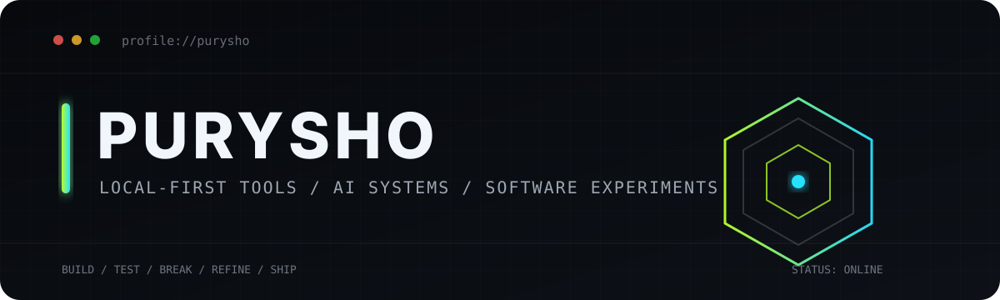

<div align="center">
  
</div>

<br>

<div align="center">
  <strong>Independent builder making local-first software, developer tools, AI systems, and experiments.</strong><br>
  <sub>Useful over ornamental. Deterministic where possible. AI where it earns its place.</sub>
</div>

<br>


### `> system_profile`

```text
IDENTITY        PURYSHO
FOCUS           local-first software · AI systems · developer utilities
MODE            build → test → break → refine → ship
PREFERENCE      small surface area · clear purpose · usable software
```

### `> selected_systems`

<table>
<tr>
<td width="33%" valign="top">

#### [BLACKBOX](https://github.com/purysho/BLACKBOX)
Repository forensics for structure, hotspots, dependencies, risks, and suspicious code patterns.

`repo intelligence` `local-first`

</td>
<td width="33%" valign="top">

#### [Needle](https://github.com/purysho/Needle)
Private local file search for indexing, finding, browsing, and opening content across a computer.

`search` `desktop` `privacy`

</td>
<td width="33%" valign="top">

#### [PalisadeDB](https://github.com/purysho/PalisadeDB)
A custom local database engine with its own pager, B+ tree, SQL layer, and recovery machinery.

`database internals` `systems`

</td>
</tr>
</table>

<table>
<tr>
<td width="50%" valign="top">

#### [Threadline](https://github.com/purysho/threadline)
Evidence-first personal intelligence built around commitments, temporal dependencies, contradictions, and deterministic briefing.

`reasoning systems` `desktop`

</td>
<td width="50%" valign="top">

#### [More builds](https://github.com/purysho?tab=repositories)
Small tools, experiments, game systems, research projects, and things built because they seemed worth existing.

`experiments` `shipping`

</td>
</tr>
</table>


### `> toolkit`

```text
LANGUAGES       Python · TypeScript · JavaScript · Rust
INTERFACES      React · Tauri · Tkinter · CLI
SYSTEMS         Git · GitHub Actions · local storage · custom tooling
AI              model APIs · prompt systems · evaluation · agent workflows
```

### `> operating_principles`

```text
01  LOCAL FIRST
02  DETERMINISTIC WHERE POSSIBLE
03  AI WHERE USEFUL
04  KEEP THE SURFACE AREA SMALL
05  BUILD THE TOOL YOU ACTUALLY WANT TO USE
06  SHIP SOMETHING REAL
```


<div align="center">
  <sub>More at <a href="https://purysho.github.io">purysho.github.io</a> · Repositories below ↓</sub>
</div>
