

  

  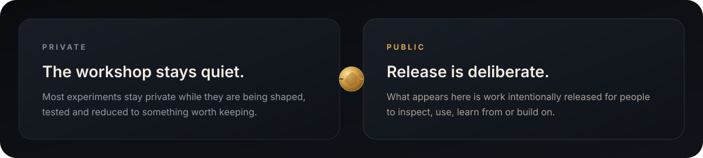

 

  FLAGSHIP · V1.0.1 RELEASED 
  <strong>Switchyard</strong>

  <a href="https://github.com/purysho/Switchyard">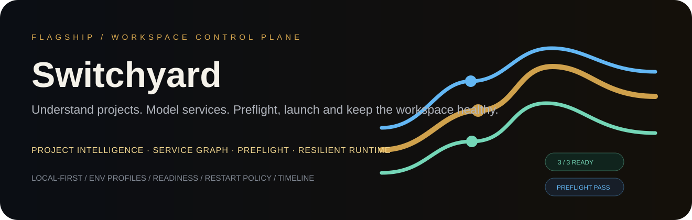</a>

<a href="https://github.com/purysho/Switchyard">Open Switchyard ↗</a> &nbsp;·&nbsp; <a href="https://github.com/purysho/Switchyard/releases/tag/v1.0.1">Download v1.0.1 ↓</a>

  FEATURED PRODUCT · V0.20.0 
  <strong>QuantOS</strong>

  <a href="https://github.com/purysho/QuantOS">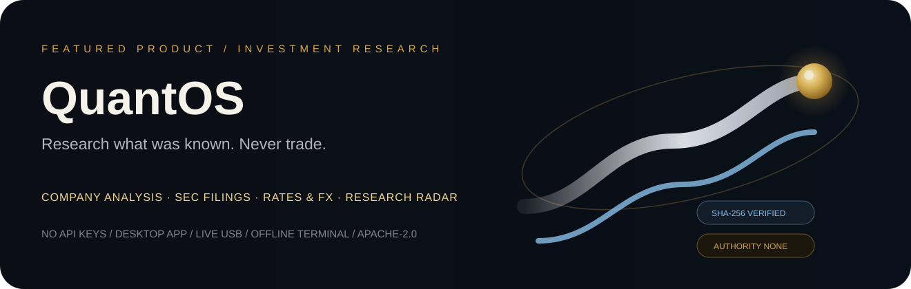</a>

<a href="https://github.com/purysho/QuantOS">Open QuantOS ↗</a> &nbsp;·&nbsp; <a href="https://github.com/purysho/QuantOS/releases/latest">Download latest ↓</a>

  RECENT BUILDS · SEP 2026 
  <strong>New work</strong>

<table>
<tr>
<td width="33.33%" valign="top">
  <a href="https://github.com/purysho/Cascade">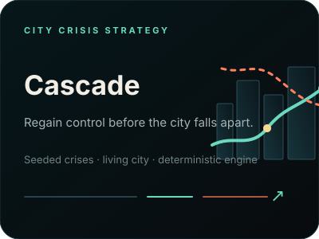</a>
  
<a href="https://purysho.github.io/Cascade/">Play Cascade ↗</a>

</td>
<td width="33.33%" valign="top">
  
  
<a href="https://github.com/purysho/Latch">Open Latch ↗</a> &nbsp;·&nbsp; <a href="https://github.com/purysho/Latch/releases/tag/v0.1.0">Download v0.1.0 ↓</a>

</td>
<td width="33.33%" valign="top">
  <a href="https://github.com/purysho/salesforce-writing-coach">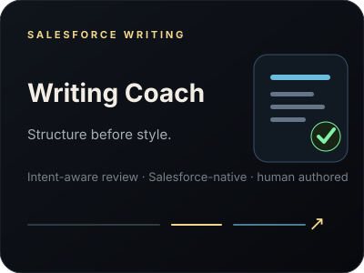</a>
  
<a href="https://github.com/purysho/salesforce-writing-coach">Open Writing Coach ↗</a>

</td>
</tr>
</table>

 

  SELECTED WORK 
  <strong>Selected projects</strong>

UNDERSTAND

<table>
<tr>
<td width="25%" valign="top"></td>
<td width="25%" valign="top"></td>
<td width="25%" valign="top"></td>
<td width="25%" valign="top"><a href="https://github.com/purysho/Witness">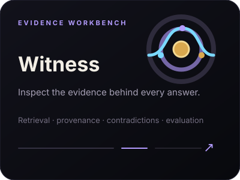</a></td>
</tr>
</table>

<a href="https://purysho.github.io/understand/">Explore Understand ↗</a>

 

OPERATE

<table>
<tr>
<td width="33.33%" valign="top"><a href="https://github.com/purysho/Relay">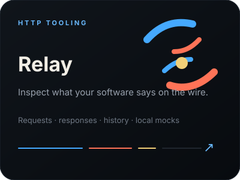</a></td>
<td width="33.33%" valign="top"><a href="https://github.com/purysho/Forge">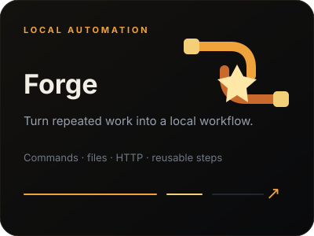</a></td>
<td width="33.33%" valign="top"><a href="https://github.com/purysho/Pulse">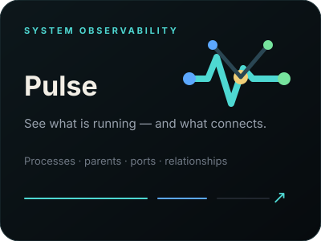</a></td>
</tr>
</table>

<a href="https://purysho.github.io/operate/">Explore Operate ↗</a>

 

MAINTAIN

<table>
<tr>
<td width="33.33%" valign="top"><a href="https://github.com/purysho/Rift">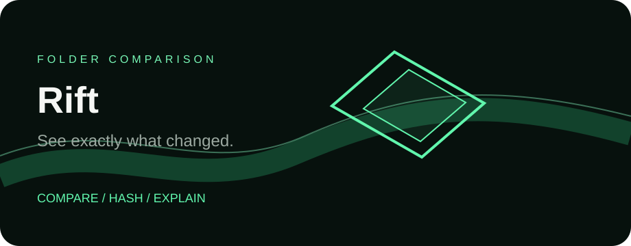</a></td>
<td width="33.33%" valign="top"><a href="https://github.com/purysho/Cull">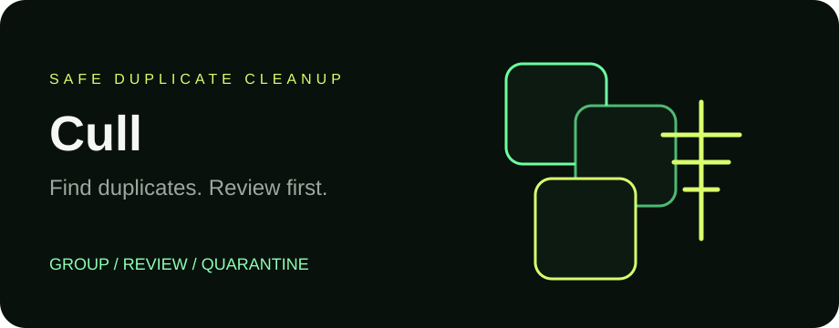</a></td>
<td width="33.33%" valign="top"><a href="https://github.com/purysho/Quarry">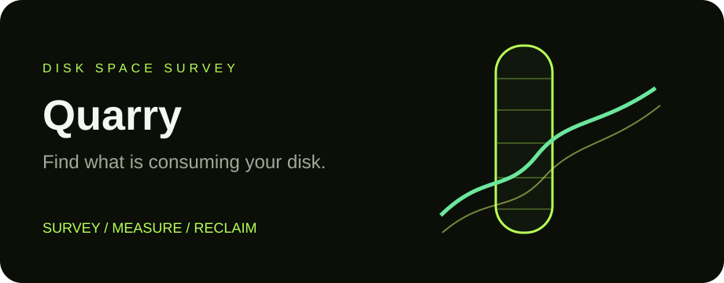</a></td>
</tr>
</table>

<a href="https://purysho.github.io/maintain/">Explore Maintain ↗</a>

 

WANDER

<table>
<tr>
<td width="33.33%" valign="top"><a href="https://github.com/purysho/TreasureHunt">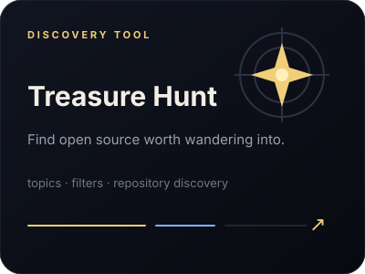</a></td>
<td width="33.33%" valign="top"></td>
<td width="33.33%" valign="top"><a href="https://github.com/purysho/Lodestar">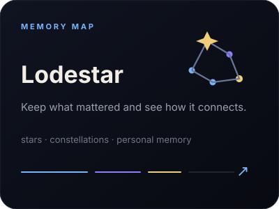</a></td>
</tr>
</table>

<a href="https://purysho.github.io/wandering/">Explore the Wandering collection ↗</a>

 

 

 

  <a href="https://github.com/purysho?tab=repositories"><strong>Explore public repositories ↗</strong></a>
  &nbsp;&nbsp;·&nbsp;&nbsp;
  <a href="https://purysho.github.io"><strong>purysho.github.io ↗</strong></a>

 

