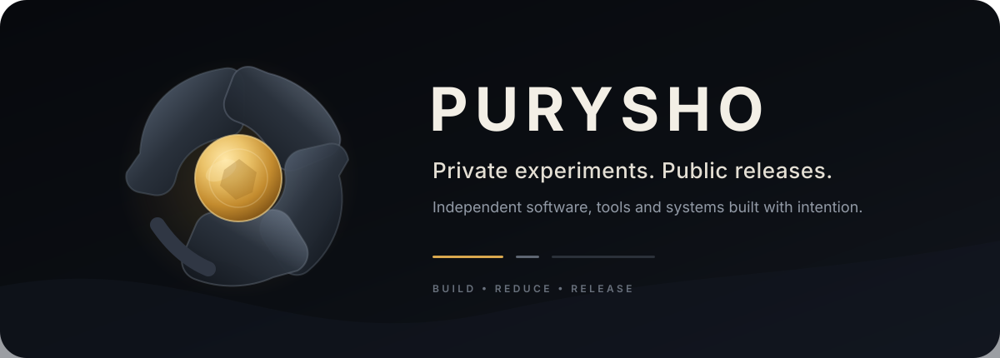
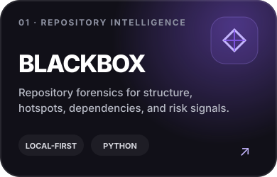
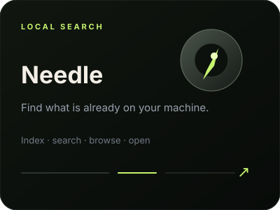
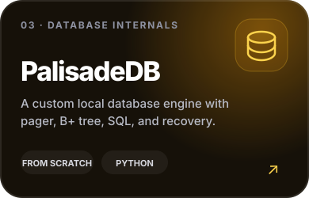
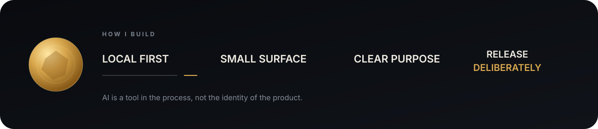
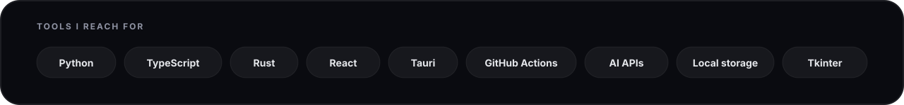

  

  <strong>I build focused software, local-first tools, developer utilities, and AI systems.</strong> 
  Most experiments stay private. What appears here is intentionally released for other people to inspect, use, or build on.

 

<h2 align="center">Public releases</h2>

Three small tools with very different jobs — all designed to be understandable, local, and useful.

<table>
<tr>
<td width="33.33%" valign="top">

</td>
<td width="33.33%" valign="top">

</td>
<td width="33.33%" valign="top">

</td>
</tr>
</table>

 

  

 

  

 

  <a href="https://github.com/purysho?tab=repositories"><strong>Explore public repositories ↗</strong></a>
  &nbsp;&nbsp;·&nbsp;&nbsp;
  <a href="https://purysho.github.io"><strong>purysho.github.io ↗</strong></a>

Build something useful. Keep the surface small. Ship it.

